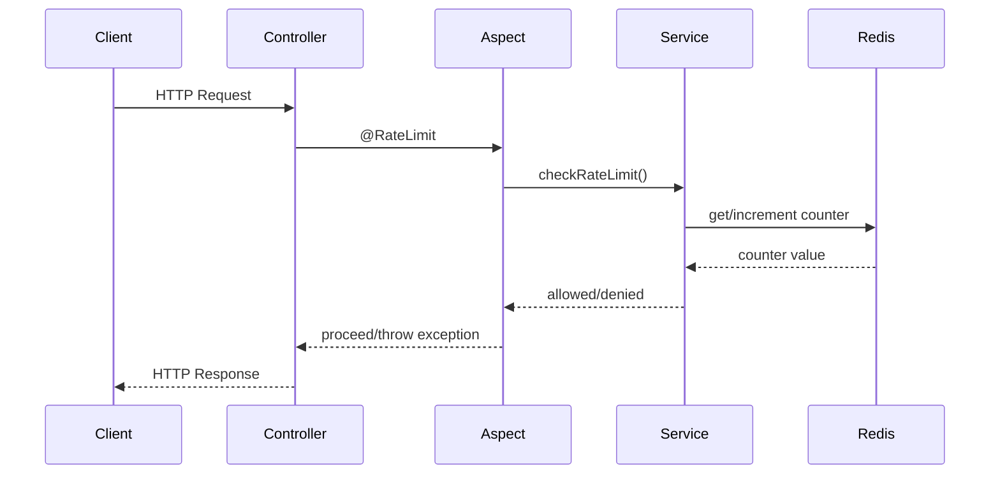

# Rate Limiter Architecture

This document describes the architecture and design of the Rate Limiter service.

## Overview

The Rate Limiter service is built using Spring Boot and follows a modular architecture with the following key components:

```
com.example.ratelimiter/
├── annotation/
│   └── RateLimit.java
├── aspect/
│   └── RateLimitAspect.java
├── config/
│   └── RateLimiterConfig.java
├── controller/
│   └── RateLimiterController.java
├── service/
│   └── RateLimiterService.java
└── exception/
    ├── RateLimitExceededException.java
    └── GlobalExceptionHandler.java
```

## Core Components

### 1. Rate Limit Annotation
```java
@RateLimit(key = "X-User-Id", type = "second", limit = 5)
```
- Defines rate limiting rules for endpoints
- Configurable per endpoint
- Supports different time windows and limits

### 2. Rate Limit Aspect
- Implements AOP-based rate limit checking
- Intercepts requests to rate-limited endpoints
- Validates headers and rate limits
- Throws appropriate exceptions

### 3. Rate Limiter Service
- Core rate limiting logic
- Redis-based storage
- Handles different time windows
- Manages rate limit counters

### 4. Configuration
- Default rate limits
- Redis connection settings
- Custom rate limit values

## Flow Diagram



## Key Features

1. **Distributed Rate Limiting**
   - Redis-based storage
   - Works across multiple instances
   - Consistent rate limiting

2. **Flexible Configuration**
   - Per-endpoint rate limits
   - Different time windows
   - Custom limit values

3. **Aspect-Oriented Design**
   - Clean separation of concerns
   - Non-invasive rate limiting
   - Easy to maintain

4. **Error Handling**
   - Global exception handling
   - Clear error messages
   - Proper HTTP status codes

## Data Model

### Redis Key Structure
```
{key}:{type} -> counter
```
Example: `user123:second -> 5`

### Rate Limit Types
- `second`: 1-second window
- `day`: 24-hour window
- `week`: 7-day window

## Security Considerations

1. **Header Validation**
   - Required headers
   - Header format validation
   - Missing header handling

2. **Rate Limit Bypass Prevention**
   - Server-side validation
   - Redis-based storage
   - Distributed consistency

## Performance Considerations

1. **Redis Operations**
   - Atomic increments
   - Efficient key structure
   - Automatic expiration

2. **Aspect Performance**
   - Minimal overhead
   - Efficient header extraction
   - Quick validation

## Future Improvements

1. **Additional Features**
   - Custom time windows
   - Dynamic rate limits
   - Rate limit statistics

2. **Monitoring**
   - Rate limit metrics
   - Usage statistics
   - Alerting system 